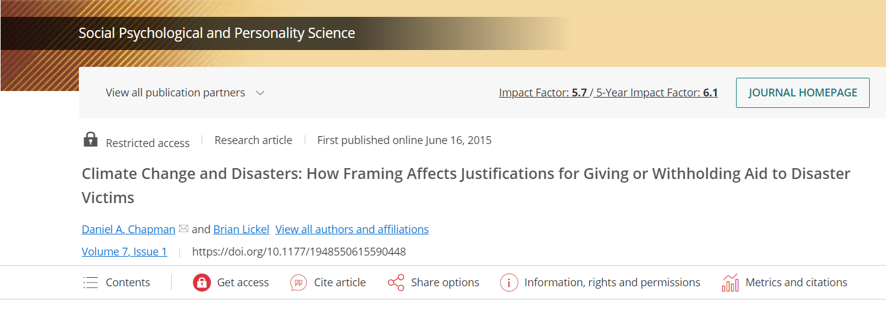
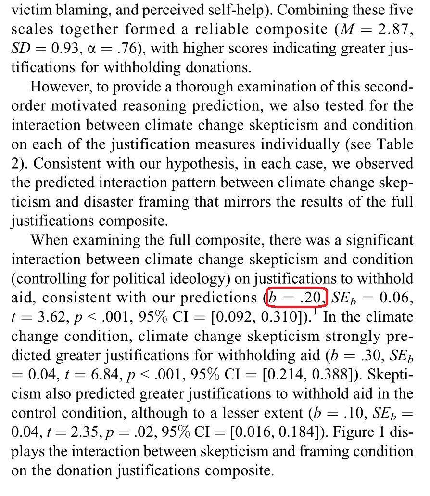
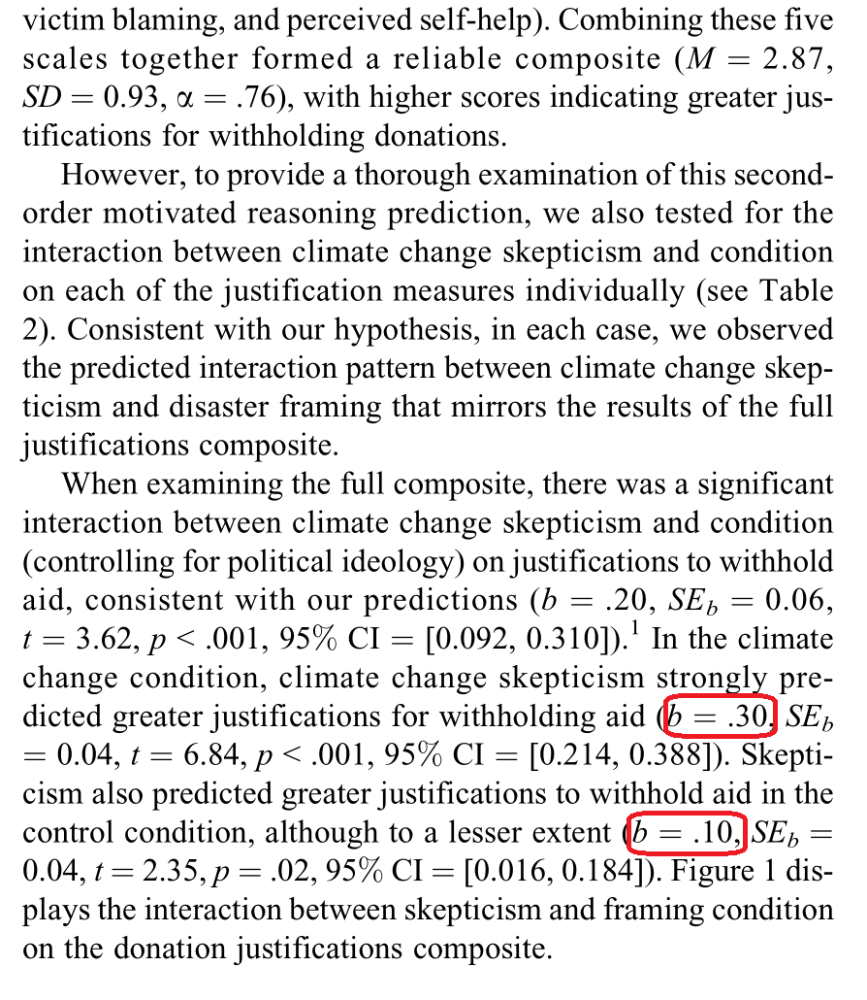
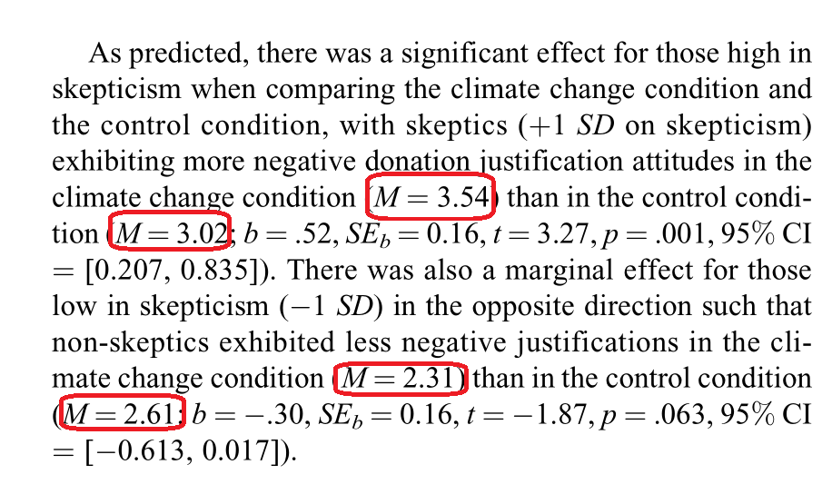
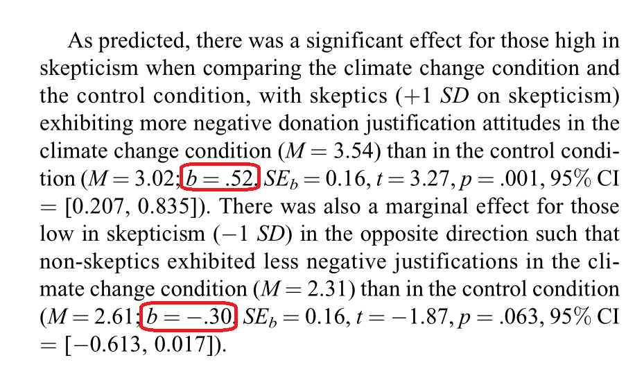
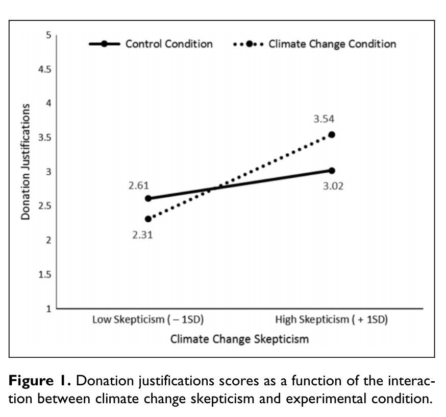
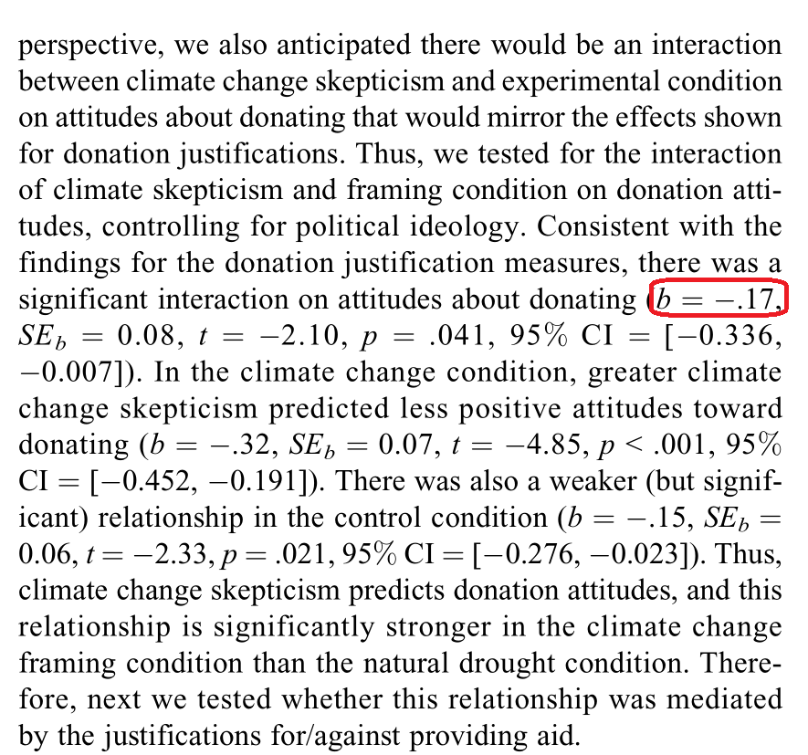
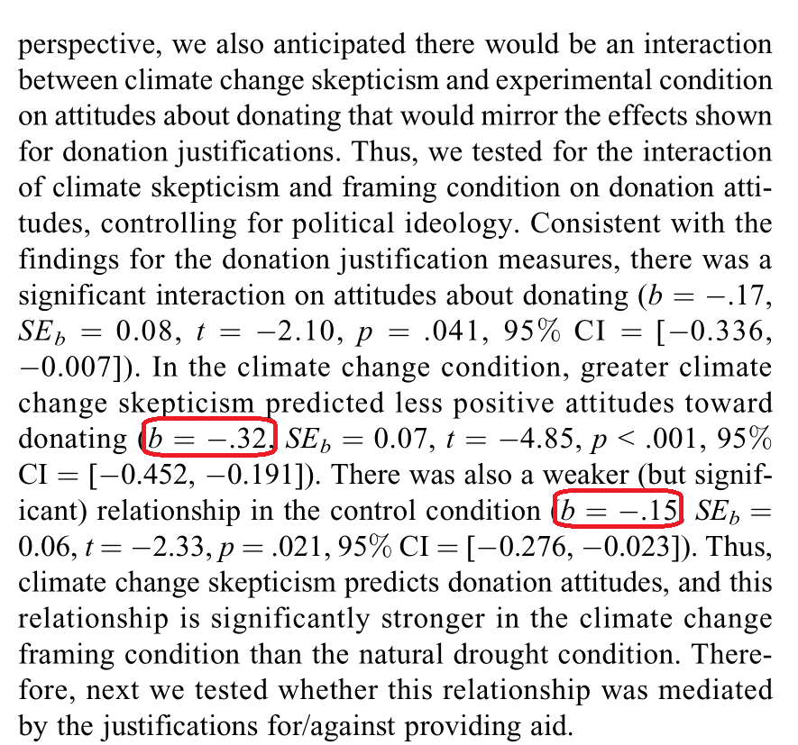
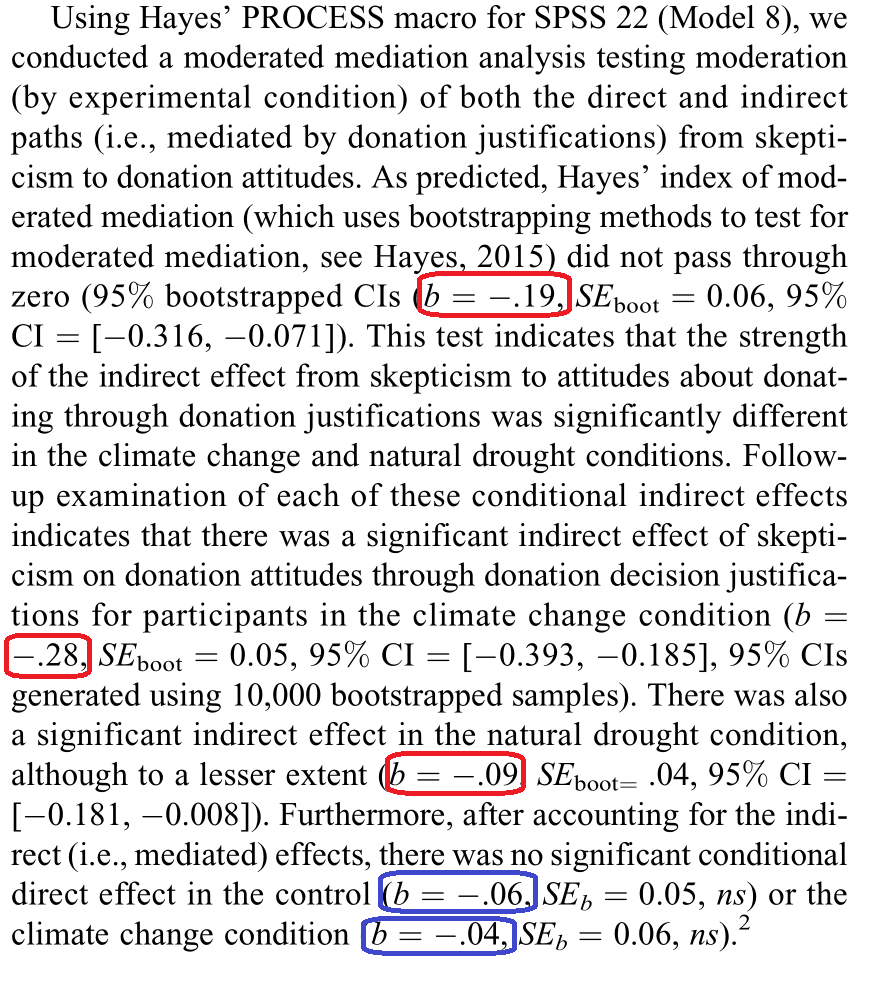

```{r setup, include=FALSE}
knitr::opts_chunk$set(
  echo       = TRUE,
  message    = FALSE,
  warning    = FALSE,
  out.width  = "100%",
  fig.asp    = 0.85, 
  fig.show   = "hold",
  fig.pos    = "center",
  fig.align  = "center",
  dpi        = 600
)

options(
  digits = 3,
  knitr.table.format = "html"
)
```


---
## 我们的目标论文

```{r, echo=FALSE}

```

.center[<https://doi.org/10.1177/1948550615590448>]


---
## 论文架构图

<br>
```{r, echo=FALSE, out.width="65%"}
library(tidyverse)
library(lavaan)
library(processR)

labels <- list(X = "skeptic", M = "justify", Y = "donate", W = "frame")
pmacroModel(8, labels = labels)
```


---
class: center, middle

# 复现开始


---
## 数据

```{r, eval=FALSE}
library(tidyverse)

d <- readr::read_csv("./data/disaster.csv") 
d
```


```{r, echo=FALSE}
library(tidyverse)

d <- readr::read_csv("./data/disaster.csv") 

d %>% 
  head(7) %>% 
  flextable::flextable()
```


---
### The Impact of Disaster Framing on Donation Justifications


.pull-left[

```{r, echo=FALSE}
labels <- list(X = "skeptic", Y = "justify", W = "frame")
pmacroModel(1, labels = labels)
```

]


.pull-right[

.footnotesize[
```{r}
library(modelsummary)

dc <- d %>% 
   mutate(across(c(skeptic), ~ .x - mean(.x))) %>% 
   mutate(frame = as.factor(frame))


mod1 <- lm(justify ~ skeptic,                         data = dc)
mod2 <- lm(justify ~ skeptic + frame + frame:skeptic, data = dc)
```
]


]


---
### The Impact of Disaster Framing on Donation Justifications

.pull-left[

```{r, echo=FALSE}
labels <- list(X = "skeptic", Y = "justify", W = "frame")
pmacroModel(1, labels = labels)
```

]

.pull-right[


.footnotesize[
```{r, eval=FALSE}
library(modelsummary)

dc <- d %>% 
   mutate(across(c(skeptic), ~ .x - mean(.x))) %>% 
   mutate(frame = as.factor(frame))


mod1 <- lm(justify ~ skeptic,                         data = dc)
mod2 <- lm(justify ~ skeptic + frame + frame:skeptic, data = dc)
```
]

```{r, echo=FALSE}
lst(mod1, mod2) %>% 
  modelsummary::modelsummary(
    estimate   = "{estimate}{stars}",
    statistic  = c("conf.low", "conf.high", "p.value"),
    shape      = term ~ model + statistic,
    fmt        = fmt_statistic(estimate = 3),
    coef_omit  = "(Intercept)",
    output     = "gt"
  ) %>% 
  gt::data_color( 
    columns = 6,
    rows    = 3,
    colors  = "orange"
  ) %>% 
  gt::tab_options(
    table.font.size = 9
  )
```
]


---
### The Impact of Disaster Framing on Donation Justifications

.pull-left[

```{r, echo=FALSE}

```

]

.pull-right[


.footnotesize[
```{r, eval=FALSE}
library(modelsummary)

dc <- d %>% 
   mutate(across(c(skeptic), ~ .x - mean(.x))) %>% 
   mutate(frame = as.factor(frame))


mod1 <- lm(justify ~ skeptic,                         data = dc)
mod2 <- lm(justify ~ skeptic + frame + frame:skeptic, data = dc)
```
]

```{r, echo=FALSE}
lst(mod1, mod2) %>% 
  modelsummary::modelsummary(
    estimate   = "{estimate}{stars}",
    statistic  = c("conf.low", "conf.high", "p.value"),
    shape      = term ~ model + statistic,
    fmt        = fmt_statistic(estimate = 3),
    coef_omit  = "(Intercept)",
    output     = "gt"
  ) %>% 
  gt::data_color( 
    columns = 6,
    rows    = 3,
    colors  = "orange"
  ) %>% 
  gt::tab_options(
    table.font.size = 9
  )
```
]


---
### The Impact of Disaster Framing on Donation Justifications

.pull-left[

```{r, echo=FALSE}

```

]

.pull-right[

.footnotesize[
```{r, eval=FALSE}
library(marginaleffects)

mod2 %>% 
  marginaleffects::slopes(  #<<
    variables = "skeptic",
    newdata   = datagrid(frame = c(0, 1))
  ) %>% 
  as_tibble()
```
]

```{r, echo=FALSE}
library(marginaleffects)

mod2 %>% 
  marginaleffects::slopes( 
    variables = "skeptic",
    newdata   = datagrid(frame = c(0, 1))
  ) %>% 
  as_tibble() %>% 
  select(1:6, 8:9) %>% 
  flextable::flextable() %>% 
  flextable::colformat_double(digits = 3) %>% 
  flextable::fontsize(size = 9) %>% 
  flextable::line_spacing(space = 0.8) %>% 
  flextable::color(j = "estimate", color = "red") %>% 
  flextable::autofit()
```

]


---
### The Impact of Disaster Framing on Donation Justifications

.pull-left[

```{r, echo=FALSE}

```

]

.pull-right[

.footnotesize[
```{r, eval=FALSE}
library(marginaleffects)

mod2 %>%
  marginaleffects::predictions( #<<
    newdata = datagrid(
      frame = unique,
      skeptic = function(x) c(sd(x), -sd(x))
    )
  ) %>%
  as_tibble() 
```
]


```{r, echo=FALSE}
library(marginaleffects)

mod2 %>%
  marginaleffects::predictions( #<<
    newdata = datagrid(
      frame = unique,
      skeptic = function(x) c(sd(x), -sd(x))
    )
  ) %>%
  as_tibble() %>% 
  select(1:5, 7:8) %>% 
  flextable::flextable() %>% 
  flextable::colformat_double(digits = 3) %>% 
  flextable::fontsize(size = 9) %>% 
  flextable::line_spacing(space = 0.8) %>% 
  flextable::color(j = "estimate", color = "red") %>% 
  flextable::autofit()
```


]


---
### The Impact of Disaster Framing on Donation Justifications

.pull-left[

```{r, echo=FALSE}

```

]

.pull-right[

.footnotesize[
```{r, eval=FALSE}
mod2 %>%
  marginaleffects::comparisons( #<<
    variables = list(frame = c(0, 1)),
    newdata   = datagrid(skeptic = function(x) c(-sd(x), sd(x)))
  ) %>%
  as_tibble() 
```
]


```{r, echo=FALSE}
mod2 %>%
  marginaleffects::comparisons(
    variables = list(frame = c(0, 1)),
    newdata   = datagrid(skeptic = function(x) c(-sd(x), sd(x)))
  ) %>%
  as_tibble() %>% 
  select(1:7, 9:10) %>% 
  flextable::flextable() %>% 
  flextable::colformat_double(digits = 3) %>% 
  flextable::fontsize(size = 9) %>% 
  flextable::line_spacing(space = 0.8) %>% 
  flextable::color(j = "estimate", color = "red") %>% 
  flextable::autofit()
```


]


---
### Figure 1

.pull-left[

```{r, echo=FALSE,out.width="85%"}

```

]

.pull-right[

.small[
```{r, eval=FALSE}
library(marginaleffects)

mod2 %>%
  marginaleffects::predictions( #<<
    newdata = datagrid(
      frame = unique,
      skeptic = function(x) c(sd(x), -sd(x))
    )
  ) %>%
  as_tibble() 
```

]


```{r, echo=FALSE, out.width="70%", fig.asp=0.7}
library(marginaleffects)

mod2 %>%
  marginaleffects::predictions(
    newdata = datagrid(
      frame = unique,
      skeptic = function(x) c(sd(x), -sd(x))
    )
  ) %>%
  as_tibble() %>%
  mutate(across(c(frame, skeptic), as.factor)) %>%
  ggplot(aes(x = skeptic, y = estimate, group = frame)) +
  geom_point(size = 2) +
  geom_line(aes(linetype = frame), size = 1.5) +
  geom_text(aes(label = round(estimate, 2)), vjust = -1) +
  scale_x_discrete(
    name   = "climate change skeptic",
    labels = c("Low skeptic(-1SD)", "High skeptic(+1SD)")
  ) +
  scale_y_continuous(
    name   = "Donation justifications",
    limits = c(1, 5),
    expand = c(0, 0)
  ) +
  scale_linetype_manual(
    name   = NULL,
    values = c("solid", "dotted"),
    labels = c("Control condition", "Climate change condition")
  ) +
  theme_classic(base_size = 16) +
  theme(
    legend.position  = c(0.5, 0.95),
    legend.direction = "horizontal",
    axis.ticks.x     = element_blank()
  ) 
```


]


---
### Moderated Mediation Analysis


.pull-left[

```{r, echo=FALSE}
labels <- list(X = "skeptic", Y = "donate", W = "frame")
pmacroModel(1, labels = labels)
```

]


.pull-right[

.footnotesize[
```{r}
library(modelsummary)

dc <- d %>% 
   mutate(across(c(skeptic), ~ .x - mean(.x))) %>% 
   mutate(frame = as.factor(frame))

mod1 <- lm(donate ~ skeptic,                         data = dc)
mod2 <- lm(donate ~ skeptic + frame + frame:skeptic, data = dc)
```
]

]


---
### Moderated Mediation Analysis


.pull-left[

```{r, echo=FALSE}
labels <- list(X = "skeptic", Y = "donate", W = "frame")
pmacroModel(1, labels = labels)
```

]


.pull-right[

.footnotesize[
```{r}
library(modelsummary)

dc <- d %>% 
   mutate(across(c(skeptic), ~ .x - mean(.x))) %>% 
   mutate(frame = as.factor(frame))

mod1 <- lm(donate ~ skeptic,                         data = dc)
mod2 <- lm(donate ~ skeptic + frame + frame:skeptic, data = dc)
```
]


```{r, echo=FALSE}
lst(mod1, mod2) %>% 
  modelsummary::modelsummary(
    estimate   = "{estimate}{stars}",
    statistic  = c("conf.low", "conf.high", "p.value"),
    shape      = term ~ model + statistic,
    fmt        = fmt_statistic(estimate = 3),
    coef_omit  = "(Intercept)",
    output     = "gt"
  ) %>% 
  gt::data_color( 
    columns = 6,
    rows    = 3,
    colors  = "orange"
  ) %>% 
  gt::tab_options(
    table.font.size = 9
  )
```

]


---
### Moderated Mediation Analysis


.pull-left[

```{r, echo=FALSE}

```

]


.pull-right[

.footnotesize[
```{r}
library(modelsummary)

dc <- d %>% 
   mutate(across(c(skeptic), ~ .x - mean(.x))) %>% 
   mutate(frame = as.factor(frame))

mod1 <- lm(donate ~ skeptic,                         data = dc)
mod2 <- lm(donate ~ skeptic + frame + frame:skeptic, data = dc)
```
]


```{r, echo=FALSE}
lst(mod1, mod2) %>% 
  modelsummary::modelsummary(
    estimate   = "{estimate}{stars}",
    statistic  = c("conf.low", "conf.high", "p.value"),
    shape      = term ~ model + statistic,
    fmt        = fmt_statistic(estimate = 3),
    coef_omit  = "(Intercept)",
    output     = "gt"
  ) %>% 
  gt::data_color( 
    columns = 6,
    rows    = 3,
    colors  = "orange"
  ) %>% 
  gt::tab_options(
    table.font.size = 9
  )
```

]


---
### Moderated Mediation Analysis

.pull-left[

```{r, echo=FALSE}

```

]


.pull-right[

```{r, eval=FALSE}
mod2 %>% 
  marginaleffects::slopes(  #<<
    variables = "skeptic",
    newdata = datagrid( frame = c(0, 1) )
  ) %>% 
  as_tibble()
```


```{r, echo=FALSE}
mod2 %>% 
  marginaleffects::slopes(  #<<
    variables = "skeptic",
    newdata = datagrid( frame = c(0, 1) )
  ) %>% 
  as_tibble() %>% 
  select(1:6, 8:9) %>% 
  flextable::flextable() %>% 
  flextable::colformat_double(digits = 3) %>% 
  flextable::fontsize(size = 9) %>% 
  flextable::line_spacing(space = 0.8) %>% 
  flextable::color(j = "estimate", color = "red") %>% 
  flextable::autofit()
```


]


---
### SEM

.pull-left[

```{r, echo=FALSE}
labels <- list(X = "skeptic", M = "justify", Y = "donate", W = "frame")
pmacroModel(8, labels = labels)
```

]

.pull-right[

.footnotesize[
```{r}
model <- "

  justify ~ a1*skeptic + a2*frame + a3*skeptic:frame
  donate  ~ c1*skeptic + c2*frame + c3*skeptic:frame + b*justify
  
  frame   ~  frame.mean*1
  frame   ~~ frame.var*frame
  
  index.mod.med       := a3*b
  
  CE.XonM             := a1 + a3*frame.mean
  CE.XonM.below       := a1 + a3*0
  CE.XonM.above       := a1 + a3*1
  
  indirect            := (a1 + a3*frame.mean)*(b)
  indirect.below      := (a1 + a3*0)*(b)
  indirect.above      := (a1 + a3*1)*(b)
  
  direct              := c1 + c3*frame.mean
  direct.below        := c1 + c3*0
  direct.above        := c1 + c3*1

  
"

semfit <- sem(model, 
              data      = d, 
              estimator = "ML", 
              se        = "bootstrap",
              bootstrap = 1000,
              mimic     = "Mplus")
```

]

]


---
### SEM

.pull-left[

```{r, echo=FALSE}

```
]

.pull-right[

.small[
```{r, eval=FALSE}
semfit %>% 
  parameterEstimates(standardized = TRUE)
```
]


```{r, echo=FALSE}
semfit %>% 
  parameterEstimates(standardized = TRUE) %>% 
  filter(op %in% c("~", ":=")) %>%  
  select(-lhs, -op, -rhs, -std.lv, -std.all, -std.nox) %>% 
  flextable::flextable() %>% 
  flextable::colformat_double(digits = 3) %>% 
  flextable::color(i = ~ str_detect(label, "indirect"), color = "red") %>% 
  flextable::color(i = ~ str_detect(label, "^direct."), color = "blue") %>% 
  flextable::fontsize(size = 9) %>% 
  flextable::line_spacing(space = 0.7) %>% 
  flextable::autofit()
```

]


---
class: center, middle

# 感谢 R 和 Stan 语言之美!

本幻灯片由 R 包 [**xaringan**](https://github.com/yihui/xaringan) 和 [**flipbookr**](https://github.com/EvaMaeRey/flipbookr) 生成

